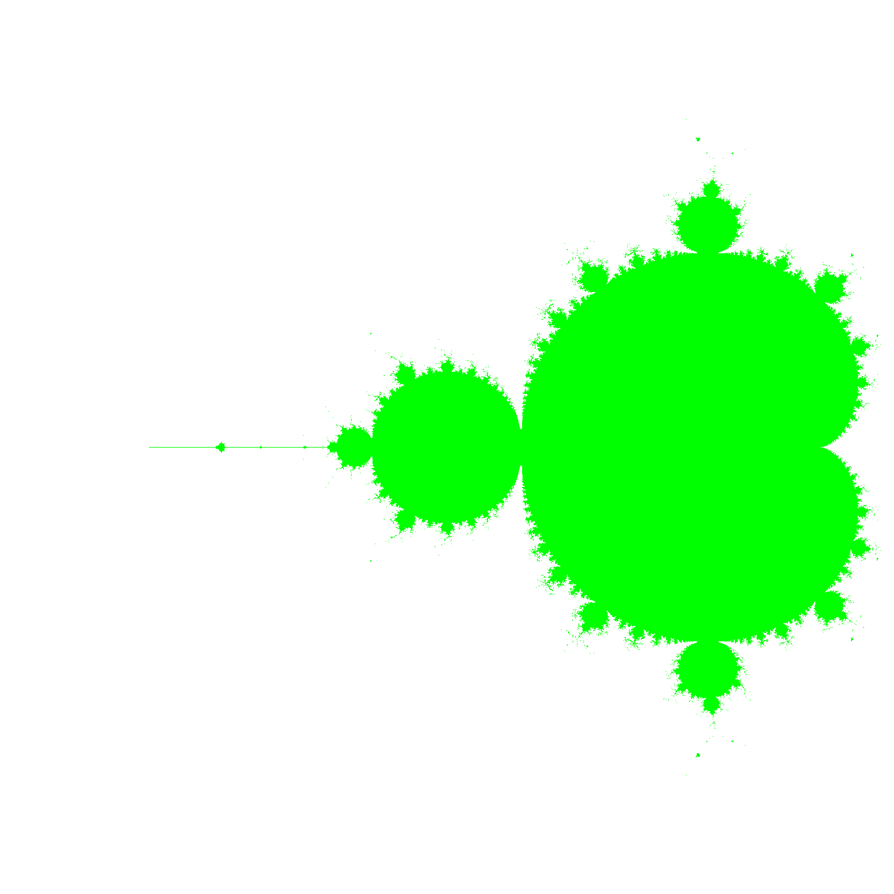
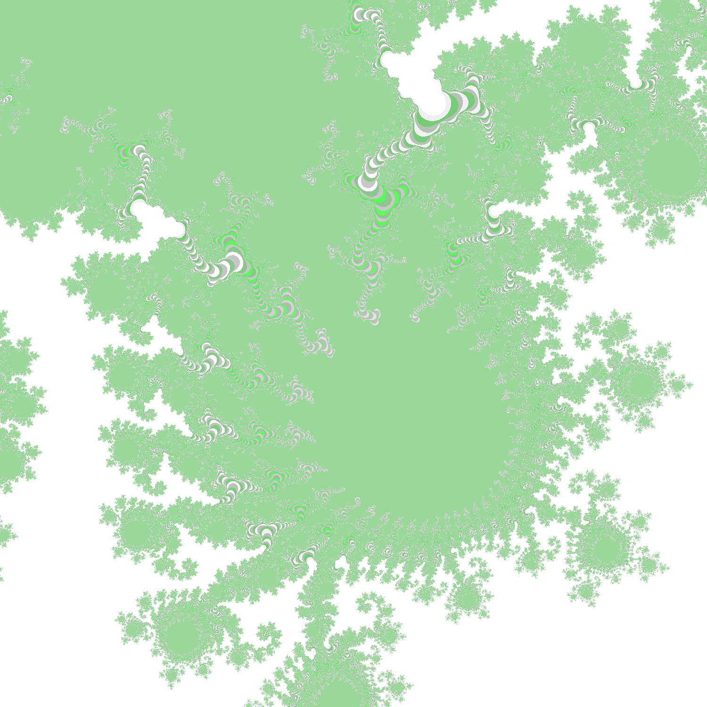

# Mandelbrot Fractals

Update the following parameters to get different patterns

```
  const RE_START = -1.5;
  const RE_END = 1.5;
  const IM_START = -2.5;
  const IM_END = 0.5;
```

### Example 1



### Example 2



### Example 3


